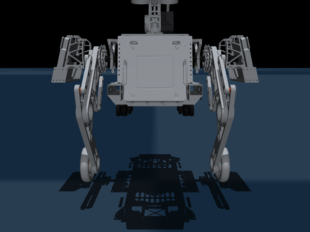

# 轮腿机器人 MuJoCo / MuJoCo-Warp 控制与训练

面向轮腿机器人的 MuJoCo 仿真、物理模型 LQR 与 **RL 残差控制**仓库。学习策略不直接替代控制器，而是输出叠加在 LQR 基线上的有界残差动作；CPU PPO、行为克隆和 MuJoCo-Warp CUDA PPO 均遵守这一接口。默认运行模式为 `sim_training`。项目没有真机通信、硬件急停回路或驱动器验收，因此**不得用于真机输出**。



上图由仓库模型渲染，展示底盘与导轮的当前装配状态。

## 控制架构

```text
高层速度/姿态/腿长指令
          -> Physical LQR 基线力矩
          -> RL 策略残差修正
          -> 独立安全裁剪与 estop
          -> MuJoCo / MuJoCo-Warp 执行器
```

残差策略的职责是补偿模型误差和扰动，不拥有绕过 LQR、安全限幅或急停逻辑的权限。`train_ppo.py`、`train_bc.py` 与 `train_warp_ppo.py` 训练/评估的都是该残差接口。

## 从这里开始

第一次使用只需走 CPU 路径；它不要求 NVIDIA GPU，也不需要单独下载 MuJoCo：`pip install` 会安装锁定版本。

```powershell
git clone https://github.com/MKKN7/wheel_leg_mjrl-lqr.git
cd wheel_leg_mjrl-lqr

conda create -n robot7 python=3.12 -y
conda activate robot7
python -m pip install --upgrade pip
python -m pip install -r requirements-lqr.txt

# 验证三个场景都能加载
python -c "import mujoco; [mujoco.MjModel.from_xml_path(p) for p in ('wheeled_infantry.xml', 'rm_train_ground.xml', 'official_standard_ground.xml')]; print('MJCF OK')"

# 两秒无界面 LQR 冒烟验证
python scripts/lqr_deploy.py --headless --seconds 2 --speed 0.0

# 完整 CPU 测试集
python -m unittest discover -s tests -t .
```

期望看到 `MJCF OK`、`LQR ready` 和测试集的 `OK`。Windows 下也可以通过仓库启动器运行任一命令：`./robot7_python.cmd scripts/lqr_deploy.py --headless --seconds 2`。

## 软件与下载

推荐先安装 Git 和 Miniconda；后续命令在 Anaconda Prompt 或已初始化 Conda 的 PowerShell 中执行。

| 软件 | 是否必需 | 用途 | 下载/说明 |
| --- | --- | --- | --- |
| Git | 是 | 克隆与更新仓库 | [Git for Windows](https://git-scm.com/download/win) |
| Python 3.10-3.13 | 是 | 运行时；推荐 3.12 | [Python Windows 下载](https://www.python.org/downloads/windows/) |
| Miniconda | 推荐 | 隔离 `robot7` 环境 | [Miniconda 官方文档](https://www.anaconda.com/docs/getting-started/miniconda/main) |
| MuJoCo 3.11.0 | 由 pip 安装 | CPU 物理仿真 | [MuJoCo Python 文档](https://mujoco.readthedocs.io/en/stable/python.html) |
| NVIDIA 驱动、CUDA Toolkit | 仅 GPU | CUDA/Warp 批量仿真 | [CUDA Toolkit](https://developer.nvidia.com/cuda-downloads) |
| CUDA 版 PyTorch | 仅 GPU | PPO 网络与 CUDA 张量 | [PyTorch 安装页](https://pytorch.org/get-started/locally/) |
| MuJoCo-Warp | 仅 GPU | GPU 物理后端 | [上游仓库](https://github.com/google-deepmind/mujoco_warp) |

`requirements-lqr.txt` 锁定了 `mujoco==3.11.0` 与 `warp-lang==1.16.0`。GPU 用户先按 PyTorch 安装页选择与驱动匹配的 CUDA 版本，再安装 requirements；最后按照 MuJoCo-Warp 上游说明从源码安装与 MuJoCo 版本匹配的包。

## 兼容性

| 平台/组件 | CPU LQR/PPO | GPU Warp 预检 | 状态 |
| --- | --- | --- | --- |
| Windows 10/11 x64 + Python 3.12 | 支持 | 支持 NVIDIA CUDA | 本仓库已验证 |
| Python 3.10、3.11、3.13 | 依赖声明支持 | 需自行验证二进制/CUDA 组合 | 兼容性待本机检查 |
| Python 3.14 | 不支持 | 不支持 | 当前二进制依赖不完整 |
| Linux x86_64 | 理论可用 | 需 NVIDIA CUDA | 未在本仓库 CI 验证 |
| macOS | 未验证 | 不支持 CUDA Warp 路径 | 不作为支持目标 |

已验证的 GPU 基线是 Windows、Python 3.12.13、MuJoCo/MuJoCo-Warp 3.11.0、Warp 1.16.0 与 CUDA 可用的 PyTorch。先运行下面的检查，返回 `True` 后再执行 GPU 命令：

```powershell
python -c "import torch, mujoco_warp, warp; print('CUDA:', torch.cuda.is_available()); print('Warp:', warp.__version__)"
```

## 常用示例

所有可直接运行的入口都在 [`scripts/`](scripts/README.md)，实现代码在 `src/wheel_leg_mjrl/`。不要再从仓库根目录寻找旧的 `.py` 脚本。

```powershell
# 物理模型控制器，无图形界面，适合验证安装
python scripts/lqr_deploy.py --headless --seconds 2 --speed 0.0

# 打开 MuJoCo 交互查看器，需要桌面图形环境
python scripts/view_wheeled_infantry.py

# CPU 残差 PPO 和残差行为克隆的最小训练，仅用于确认训练链路
python scripts/train_ppo.py --smoke
python scripts/train_bc.py --smoke

# GPU 平地物理预检：128 个 world、设备端急停和 CPU/GPU 一步 parity
python scripts/train_warp_ppo.py --smoke

# GPU 平地残差 PPO 的一轮最小训练。只有上一条预检成功后才执行。
python scripts/train_warp_ppo.py --train --smoke
```

`--train --smoke` 仍会先完成 8 秒仿真时间的零残差稳定门；在笔记本 GPU 上可能需要数分钟。只有稳定门全通过后，才会写入残差 PPO 的 smoke checkpoint。

训练检查点与指标写入 `artifacts/`，诊断日志写入 `reports/`。可调整的场景、课程、奖励和安全参数都在 `configs/`；运行循环不会重新加载 MJCF 或构造新的 MuJoCo model/data。

## 项目结构

```text
configs/                 YAML：场景、训练、课程与安全参数
scripts/                 可执行薄入口；见 scripts/README.md
src/wheel_leg_mjrl/      控制器、环境、训练和评估实现
tests/                   当前单元与回归测试
assets/ meshes*/         MJCF 所需资源
experiments/probes/      临时调试，不属于默认工作流
archive/                 归档的旧配置、旧测试和旧报告
artifacts/ reports/      生成的检查点、预览、指标与日志
```

## GPU 与课程限制

默认 GPU 预检使用 `configs/warp_batch_preflight.yaml` 的平地 `wheeled_infantry.xml`，这是当前已验证的开箱路径。RMUC 和官方 hfield 课程仍保留独立 YAML，但在当前 MuJoCo-Warp/CUDA 组合下会触发 `GPU one-step parity state is non-finite` 并被 fail-closed 阻止；不得绕过该错误启动训练。修复上游/场景的 GPU 数值一致性后，先显式运行对应配置的预检，再使用课程入口：

```powershell
python scripts/train_warp_ppo.py --config configs/warp_rmuc_grades_batch.yaml --smoke
python scripts/train_warp_curriculum.py --stage rmuc_flat --smoke
```

Warp 路径会在 GPU 上裁剪控制量、检查非有限状态、关节限位/状态爆炸并逐 world 急停；急停后必须通过 reset 恢复该 world。`real_hardware` 仅是配置接口，尚非部署功能。

## 故障排查

| 现象 | 处理方式 |
| --- | --- |
| `ModuleNotFoundError: mujoco` | 确认执行的是 `conda activate robot7` 后的 Python，而不是系统 Python 3.14。 |
| `CUDA: False` | 安装/更新 NVIDIA 驱动，按 PyTorch 安装页重装匹配的 CUDA 版 PyTorch，再重新打开终端。 |
| `No module named mujoco_warp` | 完成 MuJoCo-Warp 上游源码安装；CPU LQR/PPO 不依赖它。 |
| `GPU one-step parity state is non-finite` | GPU 端数值已发散，预检已安全拒绝运行；换回默认平地配置，或修复该场景的 Warp parity。 |
| `hfield_collision_512x286.png not found` | 检查 `assets/rmuc/` 完整存在，勿将 YAML 改为机器绝对路径。 |
| Warp 缓存目录无权限 | 删除仓库内 `.cache/warp/` 后重试，或在对应 YAML 的 `runtime` 中指定可写相对路径。 |

更多实现约束和测试原则见 [`docs/`](docs/)。
